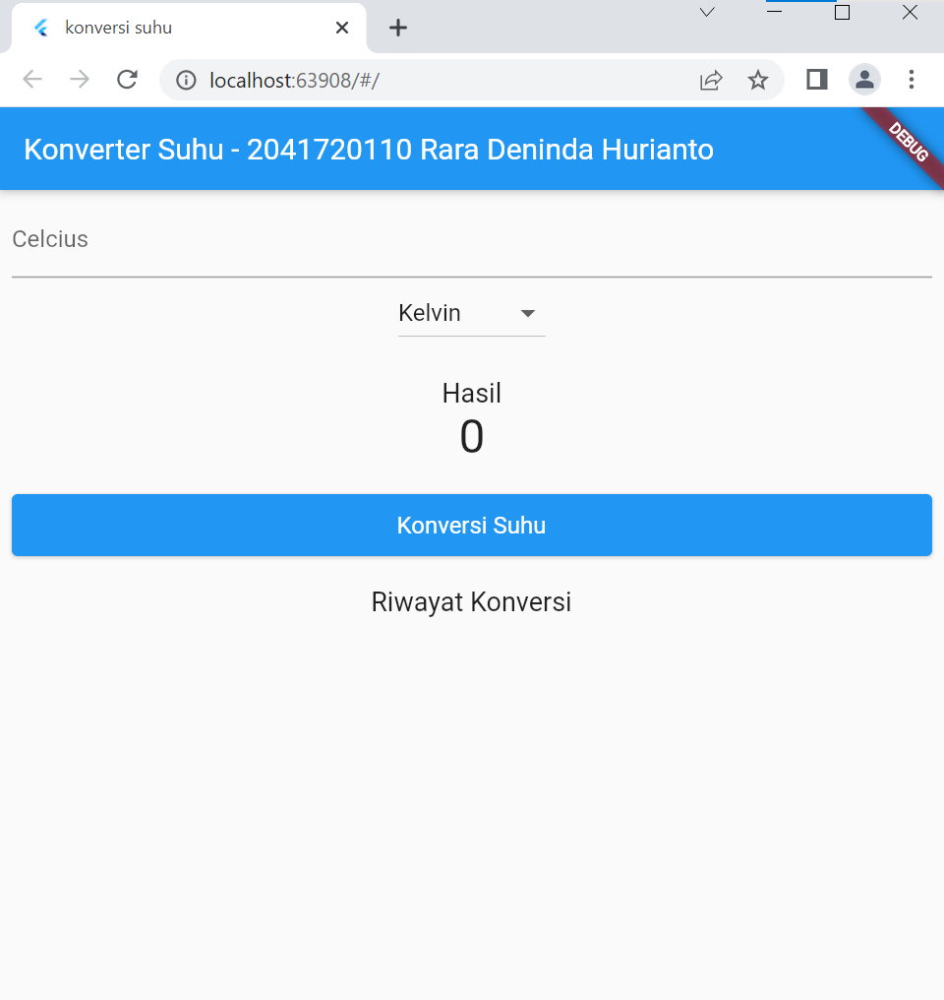
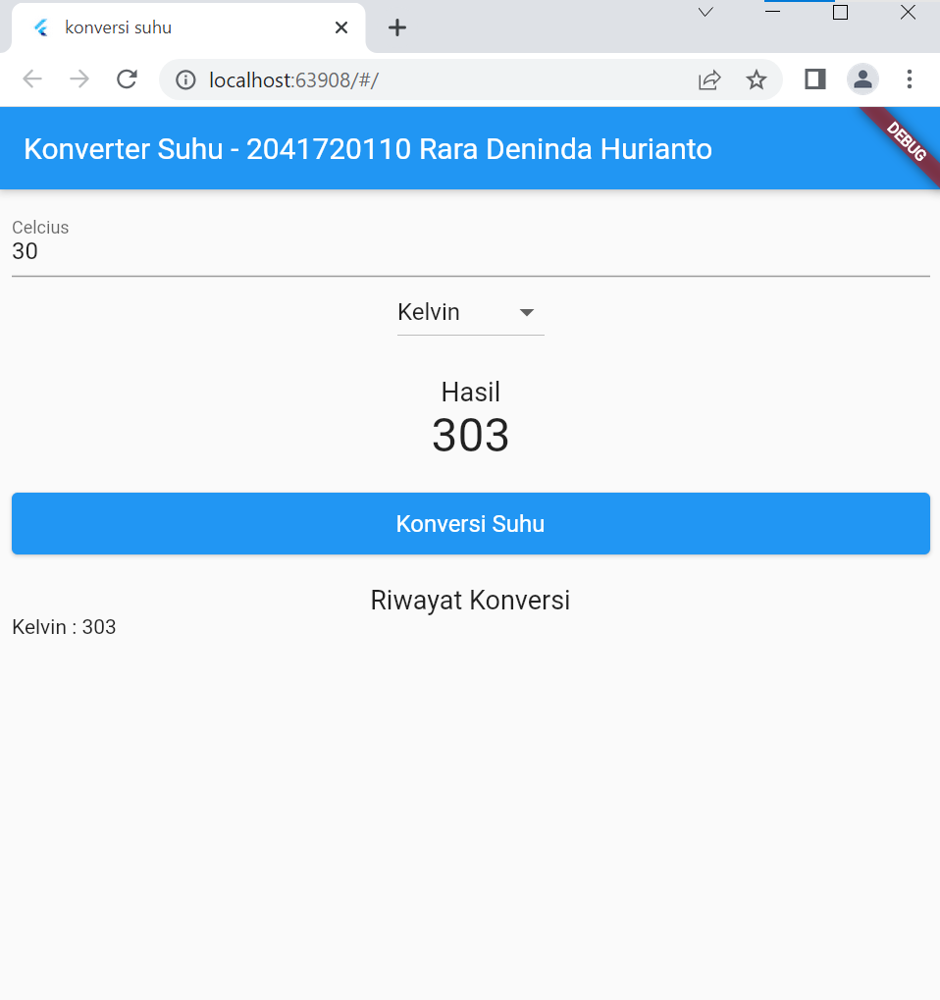
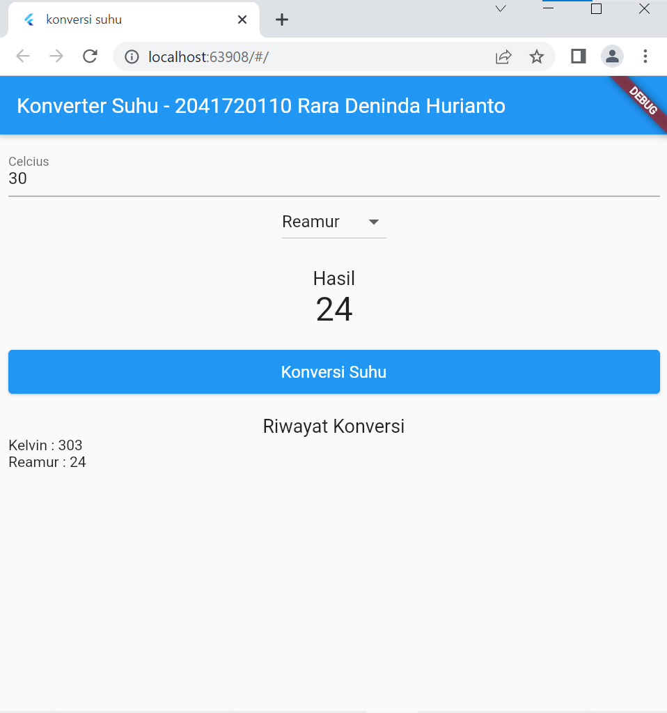
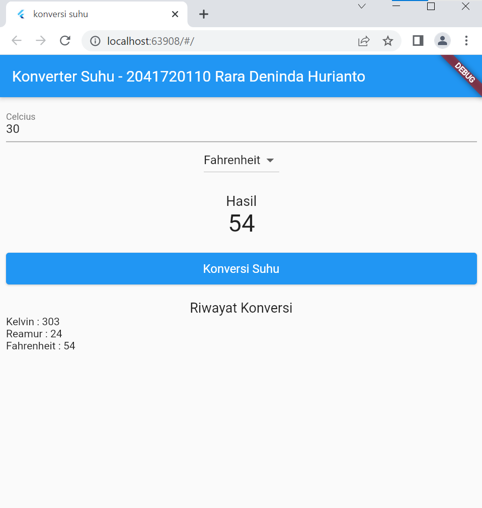

# FLUTTER LIST AND MAP
Nama  : Rara Deninda Hurianto  
NIM   : 2041720110  
Kelas : TI 3C  

## HASIL PRAKTIKUM
## 1. Tampilan awal

 
 

## 2. Mencoba konvert Celcius - Kelvin

 
 

## 3. Mencoba konvert Celcius - Reamur

 
 

## 4. Mencoba konvert Celcius - Fahrenheit

 
 
